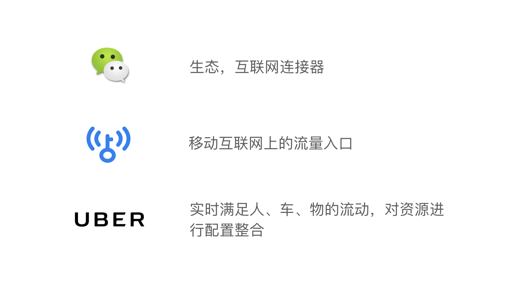
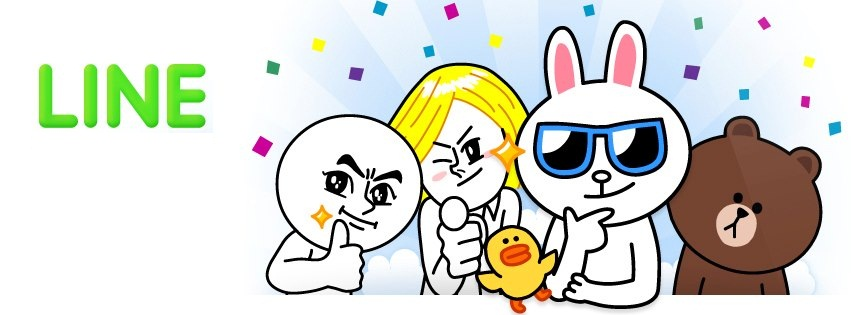

# 着手之前，为你的产品设计必要的世界观

---

## 愿景、估值、产品格局

曾经，我比较信奉坚持小而美，找到一个点，做到极致，以一颗匠者之心，做一件平凡小事，感觉很幸福。但这种态度，在中国这个野蛮生长的国度里，本质上暴露了大多数产品人在结构化思考能力上的缺失。

小而美意味着，你只需要着力于一点精雕（Xiu）细琢（Hua），不愿意接受世界是混沌的、弱落强食的这样一个事实；小而美意味着，你的用户群相比于整个盘子是不值得一提的，是自得其乐后的雁过长空。事实已经证明了，单纯小而美的企业或者产品绝大多数会在 1 ~ 3 年内死去，而唯一保持经久不衰基业长青的的秘诀：回顾 —— 豆瓣从书评到说不清楚是什么最后硬生生被资本贴上「基于兴趣、话题」标签的社区；微信从简单的移动端即时通讯软件一路走来到今天的「连接一切」影响你我生活方式的大应用平台…… 所有活着的、曾经的、小而美的最终百分之百走向了平台化。

我无法确定阿北或者张小龙在早几年会对于今天他们所做的事情，是否已经有一个朦胧的预判；还是最终被用户、时势、资本推簇之下走到了今天。但，不安于现状，对小产品、大格局的思考一定是时时刻刻、深入骨髓的。

所以，我个人的观点 —— 即便是 MVP（Minimum Viable Product，最小可行产品），设计之初也一定是隐秘而伟大的。基于公司的愿景，产品经理需要在此之上设计宏大的产品世界观。简而言之，在产品架构阶段，我们不仅仅需要满足当下的需求，更需要基于愿景、甚至迎合估值去设计产品的轮廓，明确未来大应用、大平台的方向。或许从 0 到 0.1 的这个过程走的异常纠结，0.021 » 0.034 » 0.017 » 0.081 » 0.062 …… 但至少做到了早几年比你的竞争对手更深刻理解自己所做事业的竞争壁垒、产品架构、商业模式、交互设计等等。

不要轻蔑了这样的 “眼高手低”，事实上对产品经理的挑战是巨大的 —— 在既定的狭小空间（受到需求、业务、资源的种种限制） 内，你需要确保这样的架构在至少未来一年的时间内，不管业务横向还是纵向的发展，容器依然可以很好的包容下所有内容，最关键的是让你的用户觉得这一切改变都是顺理成章的，符合他们价值取向的，而不是像耍猴玩一样的漠视用户的体验。这种博弈、隐忍和提前布局的过程，读者朋友可以细细品味。

---

*2016年年初，Uber 在美国十座城市全面铺开其独立的送餐应用 UberEats。很多人难以理解为什么一个打车应用的公司会做折腾起外卖的生意，但是如果追溯 Uber 在过去一年路演上所强调的内容，Uber 本质是在「实时满足人、车、物的流动，对资源进行的二次配置整合」。这样的 “冒失” 和 “违和” 就显得异常耀眼和高瞻远瞩。*

## 量化所有，突出重点

确定了愿景之后，我们需要围绕这样一个明确的目标，突出产品生命周期内所有的细节，最好能够通过 KPI 的方式考核最后结果的好坏。全栈产品经理在他的职能范围内，理应至少需要从产品架构、设计风格、交互形态、商业模式等方方面面维护和丰满之前所确定的愿景，这个过程一定是刻意而为之的。当然，类似的行为也应该做到潜移默化 —— 我觉得志在成为全栈的产品经理有这样的觉悟和意识跨职能的去影响运营、公关和增长团队，对外给用户所传递统一的产品价值观和文化。

*有别于微信通过「大应用」思路连接生态的做法，Line 平台化的策略大概体现在两个层面：产品层面，借统一账号和统一关系搭建广泛的应用集群；在品牌层面，传递统一的文化和价值观。不管是应用集群、还是文化传递，Line 俘获用户的技巧可能只是让一件事变得更可爱 —— 令人印象深刻的表情贴图、妙趣横生的关联应用、设计卡哇伊的界面风格以及应接不暇的生活周边等。*

## 与生俱来的产品属性
